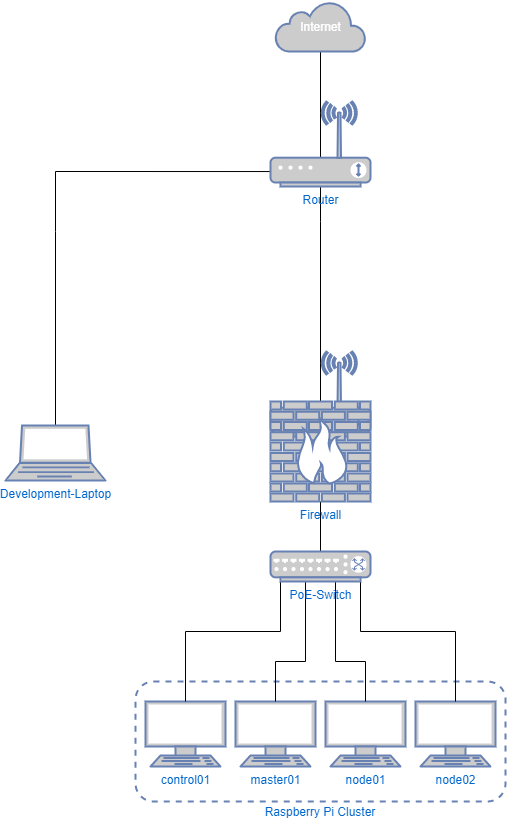

# project_automation
K8s with CRI-O by Ansible on RPi 4 - A project for learning Ansible and Kubernetes

## Motivation
I'm interested in Ansible and Kubernetes and want to learn to use them.

The plan is to use one RPi as a control node with ansible installed and a 2,5" USB HDD attached as external mass storage.

3 additional RPi will be used as one master and two worker nodes.
All RPi are connected to a PoE switch so I can poweron/poweroff the three RPi 4 externally.

Because of network boot for the three RPi 4 the plugged-in SD-Card is used as mass-storage for K8s with GlusterFS installed.

The whole environment is seperated by a VLAN at the pfSense Firewall.

## Setup

### Hardware
- 1x Raspberry Pi 3 Modell B - control
  - 1x Seagate BarraCuda Pro Compute 500GB - external storage
- 3x Raspberry Pi 4 Modell B, 4GB RAM - master & worker
  - 4x SanDisk Extreme Plus R170/W90 microSDXC 128GB Kit, UHS-I U3, A2, Class 10
- 1x Ubiquiti UniFi US-8-60W - PoE Switch
- 1x Zotac ZBOX CI327 - Firewall

### Network layout


### Software
#### Raspberry Pi 3 - 1x control Node
- OS: Raspbian Lite
- Additional Packages:
  - ansible
  - python-argcomplete
  - git
  - sshpass

#### Raspberry Pi 4 - 1x master Node, 2x worker Node
- OS: Raspbian Lite

#### Zotac ZBOX CI327 - Firewall
- OS: pfSense

## Preparation - pre ansible phase
- [install all RPi](#installing-all-raspberry-pi)
- [update/upgrade RPi and install ansible and clone project at control node](#preparing-the-control-node---short)
- [update/upgrade RPi and enable network boot at master & control node](#preparing-the-master--worker-nodes---short)

### Installing all Raspberry Pi
- download Raspbian OS from: https://www.raspberrypi.org/downloads/raspbian/
- install the OS image: https://www.raspberrypi.org/documentation/installation/installing-images/README.md
- enable SSH: https://www.raspberrypi.org/documentation/remote-access/ssh/
- plug-in the flashed SD-Card and boot RPi

### Preparing the control node - short
You can find a detailed description [here](control.md)

- update the firmware and upgrade all installed packages
- install the packages:
  - ansible
  - python-argcomplete
  - git
  - sshpass
- activate `python-argcomplete` and reboot
- create the folder `/ext/repo`
- clone the project into `/ext/repo/project_automation`

### Preparing the master & worker nodes - short
You can find a detailed description [here](nodes.md)

- update the firmware and upgrade all installed packages
- enable network boot

## Ansible phase

- switch into cloned repository folder
```bash
cd /ext/repo/project_automation
```

### control node
#### Common, user and ssh configuration
- for detailed informations see roles:
  - [common](roles/common/README.md)
  - [user_config](roles/user_config/README.md)
  - [ssh_config](roles/ssh_config/README.md)

- login as user pi
- run playbook `control.yml` with tag `install`
```bash
sudo ansible-playbook -i inventory control.yml --tags "install"
```

- reboot
```bash
sudo reboot
```

- login as new created user
- run playbook `control.yml` with tag `install`
```bash
sudo ansible-playbook -i inventory control.yml --tags "install"
```

#### Install and configure gitea
- for detailed informations see role:
  - [gitea](roles/gitea/README.md)

- run playbook `control.yml` with tag `gitea`
```bash
sudo ansible-playbook -i inventory control.yml --tags "gitea"
```

#### Install and confiure network boot for nodes
- for detailed informations see role:
  - [pxeboot](roles/pxeboot/README.md)

- run playbook `control.yml` with tag `pxe`
```bash
sudo ansible-playbook -i inventory control.yml --tags "pxe"
```

### master & worker nodes
#### Updating nodes
- for detailed informations see role:
  - [update](roles/update/README.md)

- run playbook `nodes.yml` with tag `update`
```bash
ansible-playbook -i inventory nodes.yml --tags "update" -u pi --ask-pass --become
```

#### Common, user and ssh configuration
- for detailed informations see roles:
  - [common](roles/common/README.md)
  - [user_config](roles/user_config/README.md)
  - [ssh_config](roles/ssh_config/README.md)

- run playbook `nodes.yml` with tag `install`
```bash
ansible-playbook -i inventory nodes.yml --tags "install"
```

#### Install and configre glusterfs
- for detailed informations see roles:
  - [glusterfs](roles/glusterfs/README.md)

- run playbook `nodes.yml` with tag `gluster`
```bash
ansible-playbook -i inventory nodes.yml -u steled --tags "gluster"
```